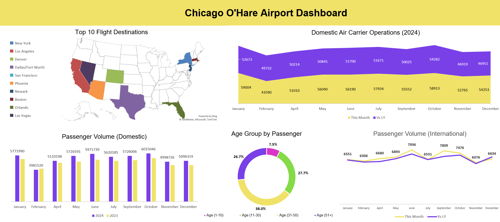

# 🛫 Chicago O’Hare Airport Dashboard

## 📌 Overview  
An Excel dashboard analyzing domestic and international air traffic trends at Chicago O’Hare International Airport (ORD). This report highlights flight volumes, top destinations, and passenger demographics from 2023–2024.

---

## 🛠️ Tools Used
- Microsoft Excel  
- Pivot Tables  
- Conditional Formatting  
- Area Chart, Donut Chart, Map Visuals

---

## 📊 Key Features
- Monthly trends in domestic carrier operations  
- Comparison of domestic vs international passenger volume  
- Top 10 destinations from O'Hare shown on a map  
- Age distribution of travelers visualized by group

---

## 📁 Files
- [`chicago-ohare-airport-dashboard.xlsx`](https://github.com/prakshalishah/chicago-ohare-airport-dashboard/blob/main/chicago-ohare-airport-dashboard.xlsx) – Final Excel file with charts and visuals  
- [`dashboard.png`](https://github.com/prakshalishah/chicago-ohare-airport-dashboard/blob/main/dashboard.png) – Snapshot of the Excel dashboard for preview/sharing

---

## 🖼️ Preview

---

## 🔗 View the File  
[📂 Click here to view the Excel dashboard](https://github.com/prakshalishah/chicago-ohare-airport-dashboard/blob/main/chicago-ohare-airport-dashboard.xlsx)
